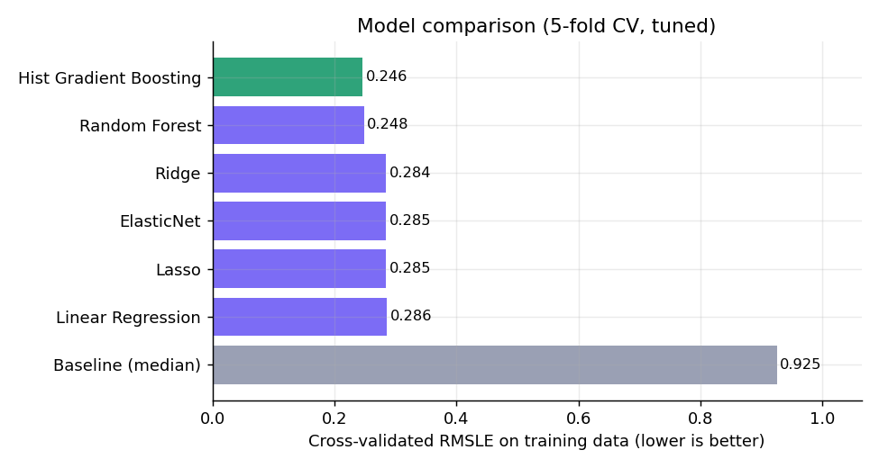
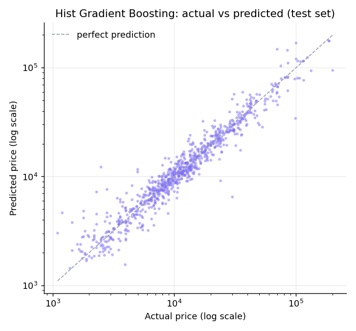

# Car Price Predictor

End-to-end machine-learning project that estimates the asking price of a used car, with an honest evaluation, a calibrated price range, automated tests, and a deployed web app.

**Live demo:** https://manas-car-price-predictor.streamlit.app

## Results

Measured on 825 listings held out from training and never used for model selection:

| | Selected model (Gradient Boosting) | Naive baseline (always predict the median) |
|---|---|---|
| Typical error (median absolute % error) | **11.6%** | 54.0% |
| Mean absolute error | **$3,033** | $11,771 |
| R² (price) | **0.87** | -0.09 |
| R² (log price) | **0.93** | 0.00 |

Each prediction also comes with an approximate **80% range** (about -23% / +28% around the estimate). On the test set, 78.4% of real prices fell inside it, close to the 80% target.



| Model | CV error (RMSLE) | Test MAE | Test median error | Test R² |
|---|---|---|---|---|
| Hist Gradient Boosting | **0.246** | $3,033 | 11.6% | 0.871 |
| Random Forest | 0.248 | $2,742 | 11.0% | 0.895 |
| Ridge | 0.284 | $3,814 | 14.0% | 0.751 |
| ElasticNet | 0.285 | $3,821 | 13.7% | 0.749 |
| Lasso | 0.285 | $3,821 | 13.9% | 0.749 |
| Linear Regression | 0.286 | $3,861 | 13.9% | 0.746 |
| Baseline (median) | 0.925 | $11,771 | 54.0% | -0.090 |

The model was selected by **cross-validated error on the training split only**. Gradient Boosting and Random Forest are statistically indistinguishable there (0.246 vs 0.248, with a standard deviation of about 0.015). Random Forest happens to score slightly better on the test set; the choice was deliberately **not** changed after looking at test results, because that would leak the test set into model selection.

### What drives the price

Re-training the model without each input (drop-column ablation, `experiments/feature_ablation.py`) shows how much the cross-validated error rises:

| Input removed | Error increase |
|---|---|
| Year | +0.174 (by far the largest) |
| Registration status | +0.073 |
| Engine volume | +0.037 |
| Brand | +0.032 |
| Model name | +0.013 |
| Body type | +0.005 |
| Mileage | +0.001 |
| Engine type | +0.000 |

Mileage adds little once the car's age is known, because the two are strongly related. The specific model name helps, but far less than year, registration or brand.

### Where it is weaker

Median error by brand (test set): Audi 7.6%, Toyota 9.2%, Renault 10.7%, Volkswagen 11.5%, Mitsubishi 11.5%, BMW 11.9%, **Mercedes-Benz 15.5%** (average error $5,845). Luxury cars have the widest price spread, so they are the hardest to predict.



## What is different from a typical notebook project

- **No leakage.** Imputation, scaling and encoding are fitted inside a scikit-learn `Pipeline` on training folds only. Duplicate listings are removed before splitting so the same car cannot appear in both train and test.
- **No train/serve skew.** The same pipeline (including feature engineering) runs in training and in the app, so predictions on raw user input match what was evaluated.
- **Correct encoding.** Categories are one-hot encoded, not label encoded. Label encoding would tell a linear model that Audi < BMW < Mercedes, an ordering that does not exist. Rare categories (fewer than 5 rows) are pooled, and unseen models do not crash the app.
- **Real hyperparameter tuning.** Seven models are tuned with 5-fold cross-validation, including the regularised ones, plus a naive baseline to prove the models add value.
- **Metrics that mean something.** Errors are reported in currency and percent, not just on a log scale.
- **Data kept honest.** Expensive cars are not trimmed away as "outliers" (they are real listings, and trimming would flatter the metrics). Impossible engine volumes (for example 99.99 L) are treated as missing and imputed.
- **Uncertainty, not just a number.** A prediction range is calibrated from out-of-fold errors and its coverage is checked on the test set.
- **Tested.** 48 automated tests cover cleaning, feature engineering, leakage safeguards, input validation, sanity behaviour (newer cars cost more, lower mileage costs more, luxury brands cost more) and the model-loading fallback.
- **Resilient deployment.** If the saved model cannot be loaded (for example after a scikit-learn upgrade), the app refits the chosen configuration from the CSV in a few seconds instead of crashing.

### Compared with version 1 of this project

Version 1 used label encoding, no tuning, and dropped the `Model` column. Its R² was measured on log price: Linear 0.830, Ridge 0.830, Lasso 0.514. On the same log-price measure, version 2 gives Linear 0.906, Ridge 0.906, tuned Lasso 0.906 and Gradient Boosting 0.927. Lasso's poor v1 score came from untuned regularisation strength, not from the method itself. Treat the comparison as indicative: version 2 also de-duplicates the data and keeps rows with missing engine volume, so the two evaluation sets are not identical.

## Project structure

```
car-price-predictor/
├── app.py                    # Streamlit UI (thin layer over the package)
├── car_price/
│   ├── config.py             # paths, column names, constants
│   ├── data.py               # loading, schema validation, cleaning
│   ├── features.py           # feature engineering + preprocessing pipeline
│   ├── models.py             # candidate models and tuning grids
│   ├── evaluate.py           # metrics and report figures
│   ├── train.py              # tune, select, evaluate, export
│   └── predict.py            # input validation, loading, prediction + range
├── experiments/
│   └── feature_ablation.py   # drop-column ablation study
├── tests/                    # 48 automated tests
├── data/raw/car_data.csv     # source data
├── models/                   # trained model + metadata.json
├── reports/                  # model_comparison.csv, feature_ablation.csv, figures/
├── .github/workflows/ci.yml  # runs the tests on every push
├── MODEL_CARD.md
└── requirements.txt
```

## Run it yourself

```bash
pip install -r requirements-dev.txt
python -m car_price.train        # retrains everything (about 4 minutes on one CPU)
python -m pytest                 # runs the tests
streamlit run app.py             # starts the app
```

The repository already contains a trained model, so `streamlit run app.py` works immediately after installing the requirements.

## Data

Used-car listings (7 brands, 312 models, years 1969-2016) from the Kaggle dataset `smritisingh1997/car-salescsv` ("1.04. Real-life example"). After removing 73 duplicate rows and 149 rows without a price, 4,123 listings remain. The source does not state the currency or the mileage unit; USD and thousands of km are assumed. Check the dataset's license on Kaggle before redistributing it.

See [MODEL_CARD.md](MODEL_CARD.md) for intended use and limitations.

## Author

Manas Sahu

## License

MIT
